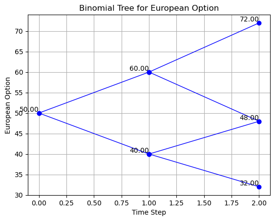

# Binomial Tree Option Pricing Model

## Overview
This project implements a binomial tree model to price European options, supporting both call and put types. It utilizes the expected movements of the underlying asset over time until expiration and incorporates factors such as stock volatility, risk-free rate, dividend yield, and more. This simulation helps compute the option's fair value through backward induction.



## Features
- **Support for European Options**: Enables calculation of prices for both European call and put options.
- **Adjustable Parameters**: Users can customize parameters such as strike price, initial stock price, risk-free rate, dividend yield, volatility, and time to expiration.
- **Visualization**: Features a function to visualize the binomial tree, enhancing understanding and analysis.

## Installation
Clone this repository and install the required Python packages to set up the project.

```bash
git clone https://github.com/yourusername/binomial-tree-option-pricing.git
cd binomial-tree-option-pricing
```

## Usage
To explore the model, open `calculation.ipynb` for a step-by-step guide and detailed commentary on the calculations.

## Reference
- *Mastering Python for Finance* by James Ma Weiming, published by Packt Publishing (2015). This book provides foundational concepts that underpin the algorithms used in this project.

## Contact
If you have any questions, please feel free to contact me via hjysam@gmail.com. 

[Project Repository](https://github.com/yourusername/binomial-tree-option-pricing)
